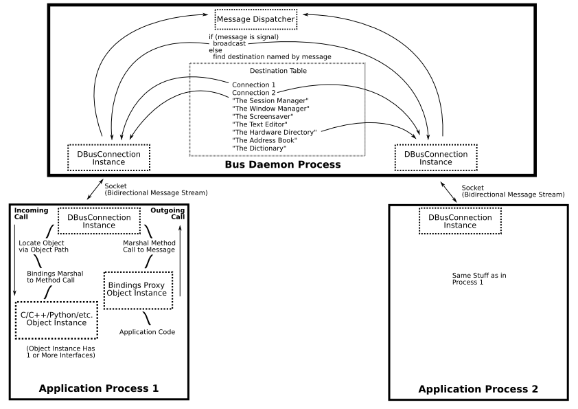

# libDBus Overview

网站:https://www.freedesktop.org/wiki/Software/dbus/

代码:https://github.com/freedesktop/dbus

## What is D-Bus?
> D-Bus is a message bus system, a simple way for **applications to talk to one another**. In addition to interprocess communication, D-Bus helps coordinate process lifecycle; it makes it simple and reliable to code a "**single instance**" application or daemon, and to **launch applications** and daemons on demand when their services are needed.

## 功能/特性

* IPC System
  * 一对多(signal)
    * 类似于广播,没有返回应答确认
    * 类似订阅,订阅感兴趣的主题,就会收到相关的消息
  * 一对一(method call)
    * 支持传参,并返回数据
    * 支持阻塞等待(超时时间),主动查询,
* coordination协调能力
  * 在app退出的时候,通知程序
  * 启动其它进程
  * 支持单个实例程序

## 系统bus和会话bus

**system bus**: 在引导时就会启动,
**session bus**: 在用户登录后启动，属于那个用户私有。它是用户的应用程序用来通信的一个会话总线。

## Note: low-level API vs. high-level binding APIs

low-level API: libdbus
high-level binding APIs: GLib, Qt, Python, Mono, Java, or whatever.
区别:

* low-level:用起来更加复杂,定制程度可以更高,更加适合自己封装,改造
* high-level:用起来更加方便

## Version numbers

version格式:major.minor.patch
minor version 是偶数的是stable版本,奇数的是dev版本
比如, development snapshots: 1.1.1, 1.1.2, 1.1.3, 1.3.4
Stable versions: 1.0, 1.0.1, 1.0.2, 1.2.1, 1.2.3

## dbus中的概念

**一对一通信流程:**

* 启动bus daemon, 生成bus address
* 连接bus, 注册bus name(唯一)
* 创建msg, 发给哪个bus(进程)->obj(实例)->Interface->Method
* 发送msg到bus
* bus发送到相应的bus name进程
* 接收到消息后返回数据



**概念级别:**

Address(bus) –> [Bus Name] (进程) –> Path(Object实例) –> Interface –> Method

| **A...**    | **is identified by a(n)...** | **which looks like...**                                      | **and is chosen by...**                               |
| ----------- | ---------------------------- | ------------------------------------------------------------ | ----------------------------------------------------- |
| Bus         | address                      | `unix:path=/var/run/dbus/system_bus_socket`                  | system configuration                                  |
| Connection  | bus name                     | `:34-907` (*unique*) or `com.mycompany.TextEditor` (*well-known*) | D-Bus (*unique*) or the owning program (*well-known*) |
| Object      | path                         | `/com/mycompany/TextFileManager`                             | the owning program                                    |
| *Interface* | *interface name*             | `org.freedesktop.Hal.Manager`                                | *the owning program*                                  |
| Member      | member name                  | `ListNames`                                                  | the owning program                                    |

## D-Bus消息类型

消息通过D-Bus在进程间传递。有四类消息：
* Method call消息：将触发对象的一个method
* Method return消息：触发的方法返回的结果
* Error消息：触发的方法返回一个异常
* Signal消息：通知，可以看作为事件消息。


## 架构流程


## 相应调试工具
Command-line命令行工具
* dbus-send: 发送消息
* dbus-monitor: 监控

Graphical图形工具
* D-Feet
* Bustle


## Reference:

* 网站:https://www.freedesktop.org/wiki/Software/dbus/
* dbus-specification规范: https://dbus.freedesktop.org/doc/dbus-specification.html
* D-Bus FAQ: https://dbus.freedesktop.org/doc/dbus-faq.html
* README: https://dbus.freedesktop.org/doc/README
* 相关中文介绍文章:https://thebigdoc.readthedocs.io/en/latest/dbus/dbus.html


```java
In pseudocode, programming without proxies might look like this:

          Message message = new Message("/remote/object/path", "MethodName", arg1, arg2);
          Connection connection = getBusConnection();
          connection.send(message);
          Message reply = connection.waitForReply(message);
          if (reply.isError()) {

          } else {
             Object returnValue = reply.getReturnValue();
          }

Programming with proxies might look like this:

          Proxy proxy = new Proxy(getBusConnection(), "/remote/object/path");
          Object returnValue = proxy.MethodName(arg1, arg2);
```