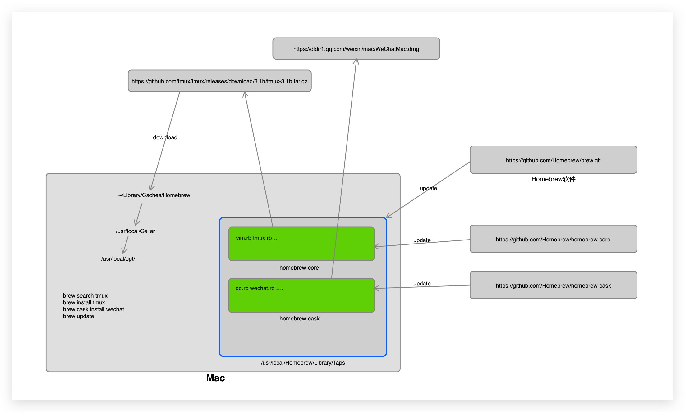

# Homebrew

官网:https://brew.sh

## 是什么？

> **The Missing Package(软件) Manager for macOS (or Linux)**

在Mac/Linux缺失的软件包管理器

* App Store --> GUI,官方
* Homebrew --> CMD,第三方维护

## 为什么要用它？

**Apple自己家的App Store**:

* 只能下载最新版的软件
* 开发者发交钱。注册苹果开发者账号，几百的年费
* 上传一个程序需要经过苹果公司的审核（尤其是第一次上传一个新的软件，有的甚至会等几个月）
* 没有命令行和服务类程序下载，管理

## 怎么用？

### Install安装

```bash
/bin/bash -c "$(curl -fsSL https://raw.githubusercontent.com/Homebrew/install/master/install.sh)"
```

> 既然Homebrew和App store的作用是类似的，就来类比来学习这款软件的使用

### App store有什么样的功能

**用户的角度**

* 搜索软件
* 查看软件信息
* 安装软件
* 更新软件
* 安装了哪些软件
* 卸载

**开发者、管理者**

* 上传软件包，提交相交信息
* 文件服务器

### 和Hombrew相关的命令

* brew help: 查看brew的帮助文档
* brew help sub_cmd: 查看brew子命令的帮助文档
* brew home：转跳到Homebrew的官网
* brew config: 查看Homebrew配置
* brew commands: 查看Homebrew有哪些命令
* brew list: 查看通过brew装了哪些软件
* brew info: 装了多少软件，有多少个文件，占用多少空间
* brew update: 更新Homebrew软件
* brew cleanup: 清理
* brew outdatad: 查看有哪些已经的软件有新版本
* **brew doctor**: 检查你系统中可能存在的问题
* brew --version: Homebrew版本
* brew --repo: Homebrew仓库位置
* brew --cache: Homebrew下载软件的缓存位置
* brew --cellar: Homebrew安装CMD软件的位置

### 和安装CMD软件相关的命令

https://docs.brew.sh/Bottles

> **Bottle**:

* brew search formula: 搜索某个软件
* brew info formula: 查看软件的info
* brew home formula: 转跳到对应软件主页
* brew install formula: 安装软件
* brew upgrade formula: 更新软件
* brew reinstall formula: 重装软件
* brew uninstall formula: 卸载软件
* brew fetch formula: 下载，不安装
* brew deps formula: 查看软件依赖的相关软件
* brew pin formula: 锁定软件版本，防止upgrade的时候更新软件
* brew unpin formula: 解除锁定，和上面相反
* brew log formula：查看软件的更新日志log


### 和安装macOS native apps相关的命令

> Cask: 用来安装Mac native apps(GUI:有界面)

* brew help cask: 查看相关cask的帮助文档
* brew cask home formula: 转跳到对应软件主页
* brew cask info formula: 相关info
* brew cask list: list
* brew cask install formula
* brew cask upgrade formula
* brew cask reinstall formula
* brew cask uninstall formula
* brew cask fetch formula: 下载，不安装
* brew cask outdated formula: 查看有哪些已经的软件有新版本
* brew cask zap formula: 删除和软件相关的所有文件

### 和Service相关的命令

> 使用macOS的launchctl（1）守护程序管理器管理后台服务(postgresql,es...)
>
> * launchd 去特定的目录去加载启动配置文件. 制定规则
> * homebrew:生成/删除文件
> * postgresql:提供启动命令

* brew help services
* [sudo] brew services [list]: 显示服务程序列表,及运行状态
* [sudo] brew services run (formula|--all): 运行服务，但没有注册开机启动
* [sudo] brew services start (formula|--all): 运行服务，同时注册开机启动
* [sudo] brew services stop (formula|--all): 停止服务，并且删除开机启动
* [sudo] brew services restart (formula|--all): 重启服务
* [sudo] brew services cleanup: Remove all unused services.

### 和软件仓库Taps相关的命令

https://docs.brew.sh/Taps

> Taps (Third-Party Repositories):软件集合的仓库

* brew tap
* brew untap

```shell
$ brew tap
elastic/tap
homebrew/cask
homebrew/cask-versions
homebrew/core
homebrew/services
```

homebrew/cask --> https://github.com/homebrew/homebrew-cask

Github: username/homebrew-tapname

**Elastic Stack**

https://github.com/elastic/homebrew-tap

```bash
$ brew tap elastic/tap
$ brew install elastic/tap/elasticsearch-full
```

### 和开发者相关的命令

...

## 内部原理

### 安装的时候做了什么

```bash
/bin/bash -c "$(curl -fsSL https://raw.githubusercontent.com/Homebrew/install/master/install.sh)"
```

* curl 下载安装脚本
* /bin/bash执行脚本
  1. 检查系统及其版本
  2. 检查git有没有装
  3. 准备工作：目录创建，目录权限检查
  4. 检查CommandLineTools
  5. 用git下载Homebrew


### 通过几个命令看看他干了什么

```bash
brew search formula
brew install formula
brew cask install wechat
brew update
brew upgrade postgresql
```



## 相关配置

### Homebrew相关的配置

https://docs.brew.sh/Formula-Cookbook#homebrew-terminology

* Homebrew程序安装位置：/usr/local/Homebrew/
* Taps仓库位置：/usr/local/Homebrew/Library/Taps
* Homebrew下载缓存的位置：~/Library/Caches/Homebrew
* CMD程序的位置：/usr/local/Cellar
* CMD程序创建链接文件位置：/usr/local/opt/
* 程序配置目录：/usr/local，~/.config，`查看相关软件文档`


### 更换源

[清华大学](https://mirrors.tuna.tsinghua.edu.cn/) ，[中科大](http://mirrors.ustc.edu.cn/)**以网站上文档为准**

```bash
# Homebrew 源
cd "$(brew --repo)"
git remote set-url origin https://mirrors.ustc.edu.cn/brew.git

# Homebrew Core 源
cd "$(brew --repo)/Library/Taps/homebrew/homebrew-core"
git remote set-url origin https://mirrors.ustc.edu.cn/homebrew-core.git

# Homebrew Cask 源
cd "$(brew --repo)"/Library/Taps/homebrew/homebrew-cask
git remote set-url origin https://mirrors.ustc.edu.cn/homebrew-cask.git

# 更换后测试工作是否正常
brew update -v
```

```bash
# Homebrew Bottles 源
# bash
echo 'export HOMEBREW_BOTTLE_DOMAIN=https://mirrors.ustc.edu.cn/homebrew-bottles' >> ~/.bash_profile
source ~/.bash_profile

# zsh
echo 'export HOMEBREW_BOTTLE_DOMAIN=https://mirrors.ustc.edu.cn/homebrew-bottles' >> ~/.zshrc
source ~/.zshrc
```

### 关闭自动更新

```bash
export HOMEBREW_NO_AUTO_UPDATE=1
```

### 关闭匿名上传数据

```bash
export HOMEBREW_NO_ANALYTICS=1
```


## 创建自己的仓库和软件

**创建自己的仓库：**

https://docs.brew.sh/How-to-Create-and-Maintain-a-Tap

如果把tap仓库放在Github管理

brew tap user/repo
https://github.com/user/homebrew-repo

**创建自己的软件：**

https://docs.brew.sh/Formula-Cookbook


## 常见问题

* https://docs.brew.sh/FAQ
* https://docs.brew.sh/Versions
* https://stackoverflow.com/questions/tagged/homebrew

### 如何安装老版本软件：

#### 大的老版本：

```shell
$ brew search postgresql
postgresql ✔                       postgresql@10                      postgresql@11
postgresql@9.4                     postgresql@9.5                     postgresql@9.6
```

#### 特定版本：

> 通过git找到对应软件版本的安装文件

```shell
$ brew log postgresql
$ cd /usr/local/Homebrew/Library/Taps/homebrew/homebrew-core 		# 切换到对应的软件仓库里面
$ git reset --hard bed9405b1f31ec884d4d047c294394873015f4a1
$ brew uninstall postgresql
$ brew install postgresql

$ git pull
$ brew upgrade postgresql
```

### 问题
搜索慢，还不确定